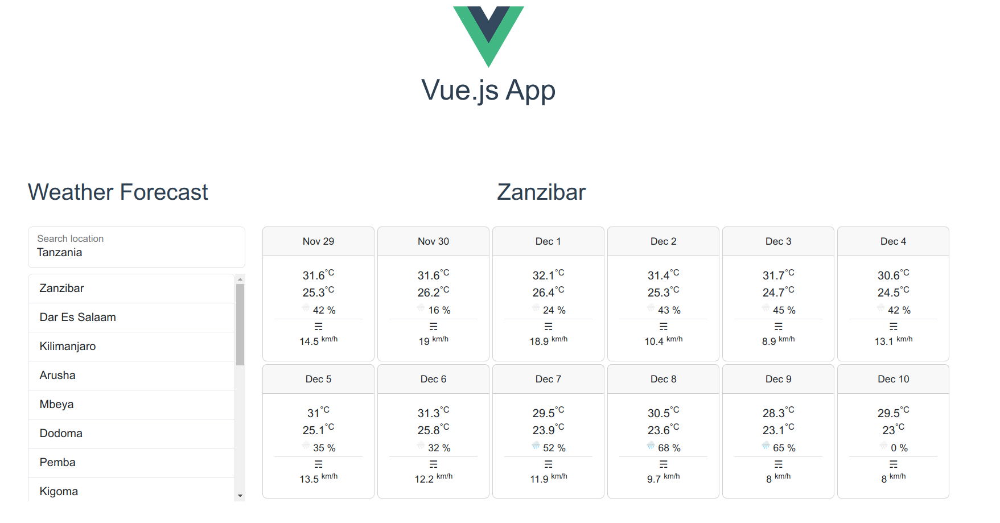

# FastAPI + Vue app

> ## Disclaimer
> 
> This is a playground app, not suitable for production environment
> 
> Designed for those who need a boilerplate for FastApi + Vue.js development.


An example app using FastAPI as backend and Vue.js as frontend. You can use it to create subapps or components
Just create a FastAPI endpoint (if needed) and a Vue component.

Backend and Frontend are fully decoupled and interchangeable and could be used in a microservices system.
I've put them here together for the sake of readability and portability.

In a real life scenario Frontend can be designed by contract by just using the OpenAPI specification (Swagger).

## Why FastAPI
Fast stands not only for performance but also for speed of development.
FastAPI provides a full REST API framework out of the box.

One of the beautiful FastAPI features – auto generation of OpenAPI specification (Swagger) based on the typehints – simply beautiful.

## Why Vue.js
React and Vue.js are probably the best choices when speaking about modern JS frameworks.

I have chosen Vue.js because it is more friendly and allows for more rapid development.

A big personal yes in favour of Vue – the magic can be done in an old-school but friendly HTML way.

## About this implementation

### Weather App
Here you can see an example implementation – WeatherForecast.

On the backend we have a decoupled endpoint returning weather json data.
Weather data is from https://open-meteo.com/

On the frontend we have a Vue component getting data from the endpoint.
City autocomplete data is from https://www.travelpayouts.com/

## Build and run

Prerequisites

- Docker
- docker-compose

```shell
docker-compose up --build
```

- Endpoints: http://localhost:8000/docs
- Frontend: http://localhost:8080

When accessing Frontend you should have this:



