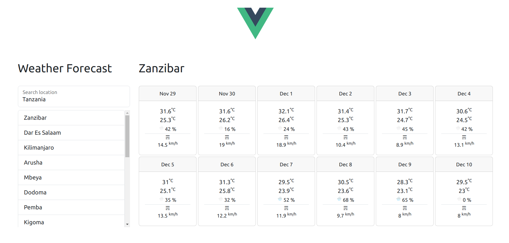

# FastAPI + Vue app

> ## Disclaimer
> 
> This is a playground app, not suitable for production environment, but can be with a few adjustments ;)
> 
> Designed for those who need a quick boilerplate for FastApi + Vue.js development.


This is an example app using FastAPI as backend and Vue.js as frontend.

Backend and Frontend are fully decoupled and changeable and could be used in a microservices system.
I've put them together in the repo for the sake of readability and portability.

In a real life scenario Frontend can be designed by contract by just using the OpenAPI specification (Swagger).

## Why FastAPI
Fast stands not only for performance but also for speed of development.
FastAPI provides a full REST API framework out of the box.

One of the beautiful FastAPI features – auto generation of OpenAPI specification (Swagger) based on the typehints – simply beautiful.

## Why Vue.js
React and Vue.js are probably the best choices when speaking about modern JS frameworks.

I have chosen Vue.js because it is more friendly and allows for more rapid development.

A big personal yes in favour of Vue – the magic can be done in an old-school but friendly HTML way.

## About this implementation

### Weather App
A Hello World app would be too little to showcase the power of Vue.js + FastAPI, so I thought of something 
interesting for the user.

Here you can see an example implementation – WeatherForecast – using some no auth external APIs.

#### Backend

On the backend we have a decoupled endpoint returning weather json data.

Weather data is from https://open-meteo.com/

#### Frontend
Plain Vue and naive Bootstrap, no other dependencies.
For more sharp and beautiful UI you may easily use other open source libs.
On the frontend we have a Vue component getting data from the endpoint.

City autocomplete data is from https://www.travelpayouts.com/

## Build and run

Prerequisites

Make sure you have just the following installed in your system (tested on Linux/macOS/Windows)  

- Docker
- docker-compose

Clone the project
```shell
git clone https://github.com/oktavdev/fastapi_vue_app
```
Change directory to {{ repoRoot }} and
```shell
docker-compose up --build
```

- Endpoints: http://localhost:8000/docs
- Frontend: http://localhost:8080

This is it, when accessing Frontend you should see the UI:



