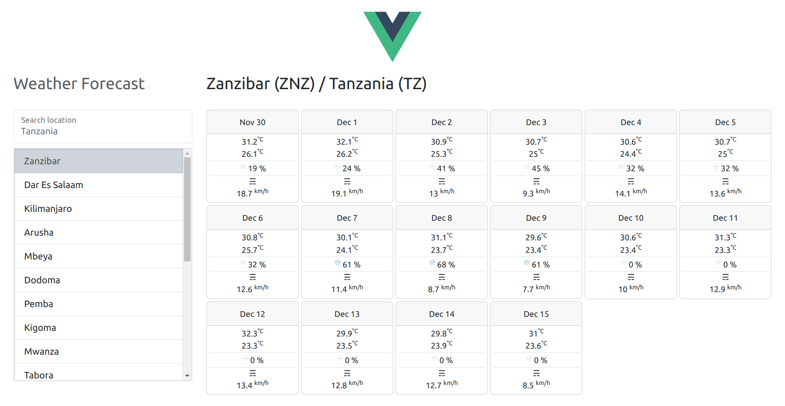

# FastAPI + Vue app

> ## Disclaimer
> 
> This is a playground app, not suitable for production environment, but can be with a few adjustments ;)
> 
> Designed for those who need a quick boilerplate for FastApi + Vue.js development.


This is an example app using FastAPI as backend and Vue.js as frontend.

Backend and Frontend are fully decoupled.
I've put them together in the repo for the sake of readability and portability.

In a real life scenario we would deploy the Frontend and Backend separately (for example 2 AWS instances) 
and Frontend would be designed by contract – based on the OpenAPI specification (Swagger).

## Why FastAPI
Fast stands not only for performance but also for speed of development.
FastAPI provides a full REST API framework out of the box – no need for a new wheel and excessive typing.

One of the beautiful FastAPI features – auto generation of OpenAPI specification (Swagger) based on the typehints – simply beautiful.

## Why Vue.js
React and Vue.js are probably the best choices when speaking about modern JS frameworks.

I have chosen Vue.js because it is more friendly for the human and allows for more rapid development.

A big personal yes in favour of Vue – the magic can be done in an old-school but friendly HTML way.

## Example app - Weather App

A Hello World app would be too little to showcase the power of Vue.js + FastAPI, so I thought of something 
interesting for the user.

Here you can see an example implementation – an app showing weather forecast based on input location.

Certainly, this is impossible without some nice data, so I have used some no auth external APIs.

### Backend

On the backend we have a decoupled endpoint returning weather json data.

Weather data is from https://open-meteo.com/

### Frontend
On the frontend we have a Vue component getting data from the endpoint.

Native Vue 3 and Bootstrap 5, no other dependencies.
That is quite enough for building a responsive and modern web application. 
For sharper UI you may easily use open source libs (e.g., vue-select for autocompleter).

City autocomplete data is from https://www.travelpayouts.com/

## Build and run

### Prerequisites

Make sure you have just the following installed in your system (tested on Linux/macOS/Windows)  

- Docker
- docker-compose

### Clone the project

If no git installed – just download and unpack the zip from https://github.com/oktavdev/fastapi-vue

else

```shell
git clone https://github.com/oktavdev/fastapi-vue.git
```

### Run

Change directory to repo root and
```shell
docker-compose up --build
```
On subsequent runs you can remove the --build flag

- Endpoints: http://localhost:8000/docs

- Frontend: http://localhost:8080

This is it, when accessing Frontend you should see the UI:



